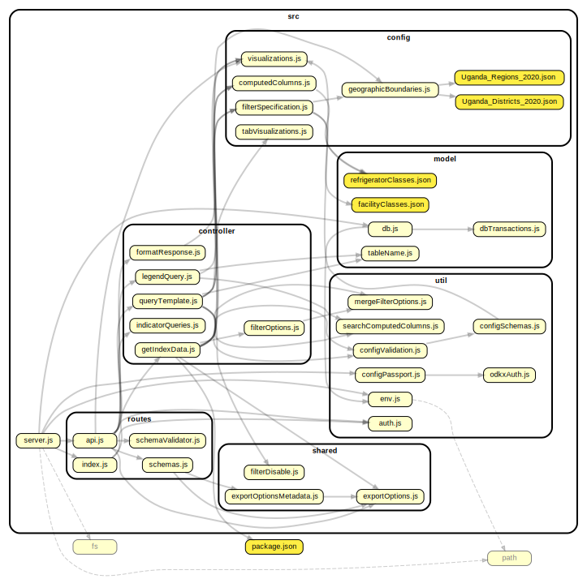
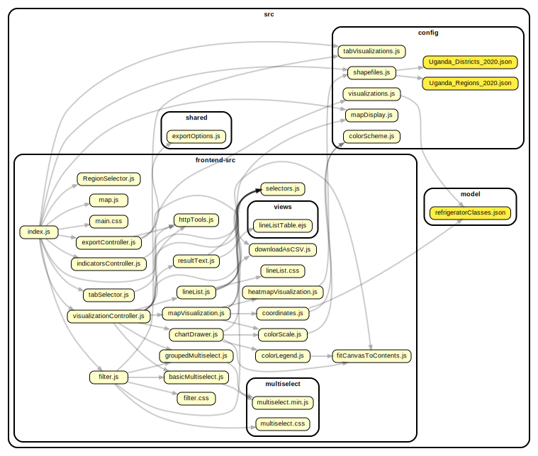

# CCIS Dashboard

This repository contains the dashboard component of the CCIS system, along with the dashboard's database. For a complete deployment including a webserver, an ODK-X sync endpoint, and ODK-X authentication server, see one of the server setup repositories:
* [uganda-ccis-server-setup](https://github.com/uw-ictd/uganda-ccis-server-setup)

## Browser support
It is recommended to use the dashboard on Chrome/Chromium. We also test on Edge, with experimental support for Firefox and Safari.

Supported browsers:
* Chrome/Chromium 84+ (tested on 99.0.4844.74-1)
* Edge 84+ (tested on 99.0.1150.39)

Experimental support:
* Firefox 63+ (tested on 98.0-2)
* Safari 13+ (tested on 13.1 and 15.3)

## Production deployment with Docker
1. Install [Docker](https://docs.docker.com/get-docker/) and [git](https://git-scm.com/downloads)
2. Clone this repository and `cd` into it
3. Get a [Mapbox token](#mapbox-api)
4. Setup your `.env` file ([instructions below](#environment-variables))
5. Build the dashboard's database
```
docker build -t ccis/dashboard-database docker-database/ -f docker-database/deploymentDB/Dockerfile
```
6. Build the dashboard docker container (this uses the `MAPBOX_API_TOKEN` environment variable)
```
docker build -t ccis/dashboard .
```
7. Start the database, providing an admin password of your choice
```
docker run -p 5432:5432 -e POSTGRES_PASSWORD=ReplaceMe -e POSTGRES_DB=coldchain ccis/dashboard-database
```
8. Start the application, replacing `80` with the port where the application should be available
```
docker run -p 80:8000 ccis/dashboard
```
9. Application should now be available from outside the docker container at `localhost:80`. Setup a webserver (e.g. nginx) to expose the application to the internet and run with https

## Mapbox API
To use the Mapbox API, you must have an API key. The API key is used as an identifier for billing purposes. To create a Mabox API Key, first make a [Mapbox account](https://www.mapbox.com/), then [generate a new one](https://docs.mapbox.com/help/glossary/access-token/) or use your default public token.

Once the key is created, place it in a `.env` file as specified below.

## Environment Variables
Create a file named `.env` in the top level, and fill in the following fields
for your deployment.
```
DB_SERVER=
DB_NAME=
DB_USER=
DB_PASS=
DB_SSL=
MAPBOX_API_TOKEN=
COOKIE_KEY=
ODKX_AUTH_URL=
ODKX_TEST_USER=
ODKX_TEST_PASSWORD=
```
* `DB_SERVER` is the URL of a Postgres server. Use `localhost` to connect to a local dockerized database
* `DB_NAME` is the name of a database on that server. Use `coldchain` if using the `deploymentDB` database
* `DB_USER` and `DB_PASS` are the login credentials for a (read-only) user on that database. Use `dashboard` and `EnsureFirewallConfigured` with the `deploymentDB` database
* `DB_SSL` is an optional boolean which should be left out when connecting to a local database. To connect to a remote database server, `DB_SSL=true` may be required
* `MAPBOX_API_TOKEN` is the token generated above. This is the only environment variable needed at build time
* `COOKIE_KEY` should be newly-generated, a strong random secret which is used to encrypt authentication details
* `ODKX_AUTH_URL` is the URL of an ODK-X sync endpoint
* `ODKX_TEST_USER` and `ODKX_TEST_PASSWORD` are only required for testing. These are credentials for a user on that ODK-X server

## Deployment Configuration
For a new deployment, update the files in the `config` folder with your GeoJSON for geographic boundaries, intended visualizations, and tab structure.
Additional documentation in the `docs/` folder describes how to use these config files.

* `visualizations.md` describes the format of the `visualizations.js` config file
* `geographicBoundaries.md` describes the format of the `geographicBoundaries.js` config file
* `tabVisualizations.md` describes the format of the `tabVisualizations.js` config file

The config files are also checked at runtime by the code in `src/util/configSchemas.js`.

## Development installation
Install [node.js](https://nodejs.org/en/), which will come with the `npm` command.\
Clone the repository and `cd` into it. Set up your `.env` file.\
From there run:
```
npm install
npm run build
npm start
```
The dashboard will be available at localhost:8000 \
You can log in to the dashboard using any user from the connected ODK-X server.\
To exit, type `Ctrl+C` in the terminal

## Testing (not for Windows)
The dashboard has a suite of tests in the `__tests__` folder. Some of these run
in the Firefox browser, and some of them use a local test database configured
with Docker. To run the tests, you'll need to install these dependencies.
1. Confirm that you have a `.env` file in the top level of the project.
2. [Install docker](https://docs.docker.com/get-docker/) (this is used by the `pretest` step to run a local PostgreSQL server)
3. [Install docker-compose](https://docs.docker.com/compose/install/) if not installed by step 1
4. Install firefox
5. From the directory of this repository, run `npm install`
6. Run `npm test`. Run `npm run linux-test` if permission issues occur.

To run a single test file:
1. Run `sudo docker-compose up`, or just `docker-compose up` depending on your user permissions. This starts a local PostgreSQL server. Note: you must only have one local SQL server running at a time. This step is only necessary for some test files; if your tests pass without it, it is not necessary.
2. Run `npx jest __tests__/<name of test file>` (the `npx` command is part of npm, and jest is the test environment we use)

## Testing on Windows
There are a few changes to run the tests on Windows:
1. Confirm that you have a `.env` file in the top level of the project.
2. [Install docker](https://docs.docker.com/get-docker/) (this is used by the `pretest` step to run a local PostgreSQL server)
3. [Install docker-compose](https://docs.docker.com/compose/install/) if not installed by step 1
4. [Install firefox developer edition](https://www.mozilla.org/en-US/firefox/developer/)
5. [Download the latest geckodriver release](https://github.com/mozilla/geckodriver/releases) and extract the folder. Add the folder to your PATH through [these steps.](https://www.architectryan.com/2018/03/17/add-to-the-path-on-windows-10/)
  Open a new PowerShell window and run "geckodriver" to confirm it has been installed.
6. From the directory of this repository in a PowerShell window, run `npm install`
7. Run `npm test` in the same PowerShell window.

Steps to run a single test file remain the same.

Notes:
* If you run into an issue with your BIOS on Windows, check out this [SO post](https://stackoverflow.com/questions/39684974/docker-for-windows-error-hardware-assisted-virtualization-and-data-execution-p/39989990#39989990)
* Some tests may inconsistently pass due to timeout errors. Run the tests individually for clarity.

## Code style
See `CONTRIBUTING.md` for a detailed summary of how to contribute good code to this project.

Information on the code review process is described in `docs/codeReview.md`, and information on the release process is in `docs/releases.md`.

## End user documentation
Some notes to support end users of the dashboard are included in `docs/END_USER_DOCUMENTATION.md`

## Architecture
The dashboard architecture is described in more detail in `docs/architecture.md`

The following dependency graphs describe the internal structure of the files
here--it's gotten a little complicated.

The server-side:



The client-side:



To update these images, make sure you have graphviz installed (we need the `dot` command) and run `npm run dependency-graph`
