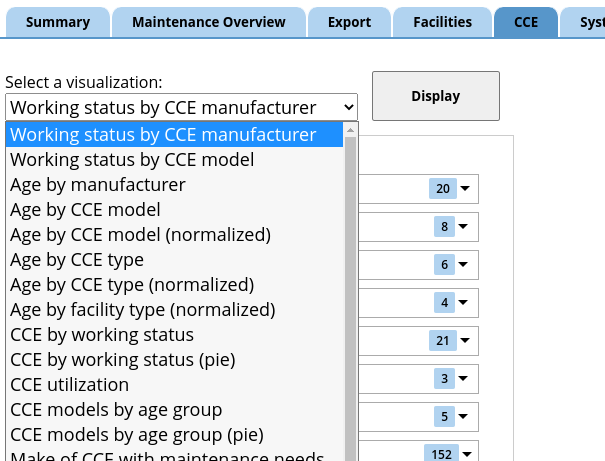
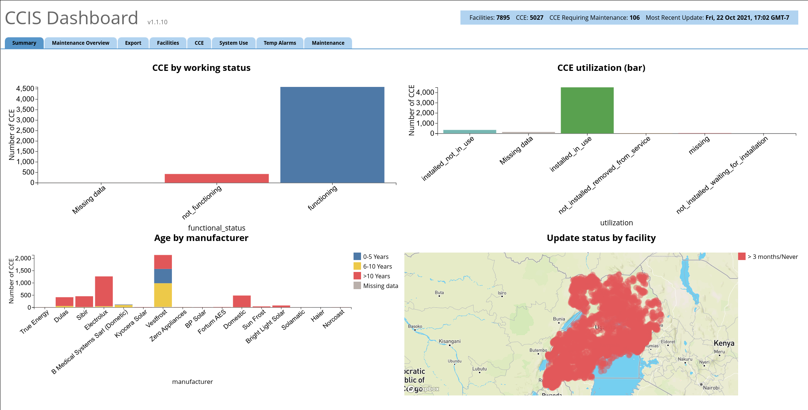
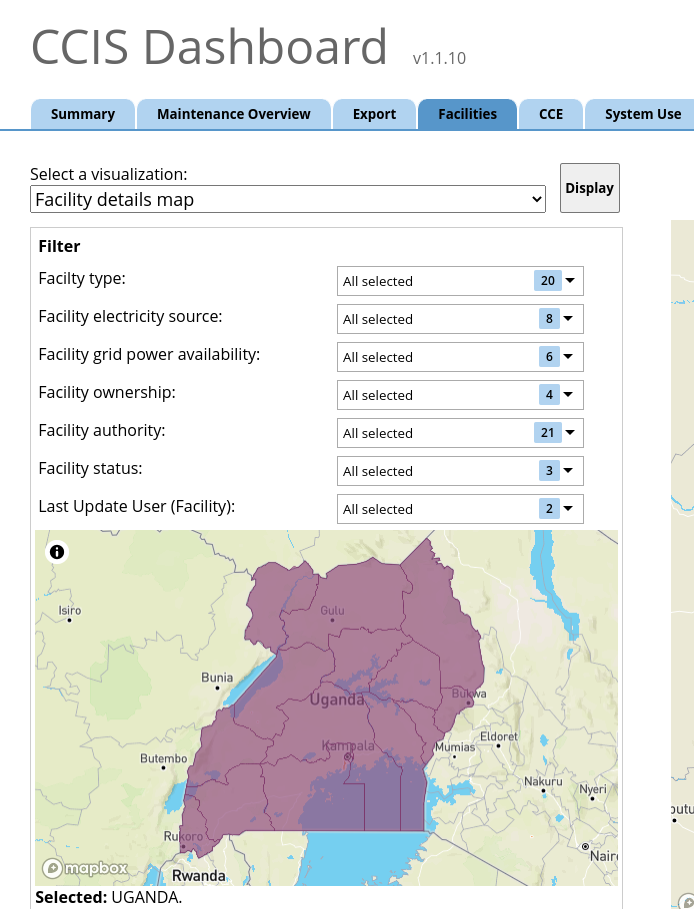

# How to update tab layouts and add visualizations to a tab
## Overview
The `src/config/tabVisualizations.js` file defines the layout of visualizations across the tabs. From here, you can add and remove tabs, choose which visualizations are included in each tab, and (for the tabs that have filters) configure the choose which fields are included among the filter options.

`tabVisualizations.js` is only for the layout of the visualizations: to define a new visualization or edit an existing one, use `visualizations.js` and the accompanying documentation in `docs/visualizations.md`.

## Q: I just added a new visualization, how do I make it show up?
Suppose you just added a new item in `visualizations.js` that looks something like this:
```
  'My new chart': {
        type: 'refrigerator',
        groupBy: 'manufacturer',
        ...
  }
```
And suppose you want this to appear on the 'CCE' tab.

Then, go to `tabVisualizations.js` and find the section for the CCE tab:
```
    'CCE': {
        tabLabel: 'CCE',
        visualizations: [
            'Working status by CCE manufacturer',
            'Working status by CCE model',
            ...
```

Adding your new visualization is as simple as adding its name to the list of visualizations here:
```
    'CCE': {
        tabLabel: 'CCE',
        visualizations: [
            'Working status by CCE manufacturer',
            'Working status by CCE model',
            'My new chart',
            ...
```

Make sure you spell the name exactly, so that the code can correctly identify your visualization.

That's all! If you want to make your new visualization show up when the tab is first loaded, edit the value of `defaultViz` to be `'My new chart'`.

## Overall structure
The `tabVisualizations.js` config file defines an object (starting with `module.exports =`). The keys of this object are unique identifiers used by the computer to distinguish the tabs, and the values are objects, each one describing a single tab. The order of tabs displayed will be the same as the order they are listed in this object.

## The `tabLabel` parameter
Each tab needs a `tabLabel`. This defines the name of the tab that will be displayed on the website. E.g.:
```
    maintenanceoverview: {
        tabLabel: 'Maintenance Overview',
        ...
```

## The Export tab
There is one unique tab here, which should not be removed: the Export tab. It is defined as follows:
```
    'Export': {
        tabLabel: 'Export',
        exportTab: true
    },
```

This configuration should not be changed, except to (a) reorder where the Export tab appears in the list of tabs or (b) change the `tabLabel` (e.g., to translate "Export" to a different language).

This is the only tab that should have `exportTab: true` set.

## The `visualizations`, `multi`, and `defaultViz` parameters
* The `visualizations` parameter expects an array of visualization names (keys in the `visualizations.js` object). These will be displayed in the dropdown selector as pictured below, or if `multi: true` is set, they will be displayed in a grid all at once. If `multi: true` is set, there should be only 4 visualizations listed.

```
'CCE': {
    tabLabel: 'CCE',
    visualizations: [
        'Working status by CCE manufacturer',
        'Working status by CCE model',
        'Age by manufacturer',
        'Age by CCE model',
        'Age by CCE model (normalized)',
        'Age by CCE type',
        ...
```



* If you include `multi: true`, then this tab will show multiple visualizations at once, and remove the filter on the left side. To use a regular single-visualization tab, just leave `multi` out or set it to `multi: false`. Example layout of a multi-vizualization tab:



* `defaultViz` expects a string, which is one of the visualizations listed for this tab in the `visualizations` parameter. This will be the first visualization displayed when the tab is first loaded

## The `enabledFilters` parameter

If `multi: true` is not set, then the tab will display a set of filters on the left. This set of filters can be configured here.  `enabledFilters` expects an array of names of filters which will be used on this tab. The filters are defined in `src/config/filterSpecification.js`, and the names to use here are the keys in that config file.

The geography filter is always included, and cannot be configured here. For settings related to the geography filter, see `src/config/geographicBoundaries.js` and `docs/geographicBoundaries.md`.

For example, the following setting enables seven filters (plus the geography filter).

```
'Facilities': {
    ...
    enabledFilters: [
        'facilityTypes',
        'facilityElectricity',
        'facilityGridPower',
        'facilityOwnership',
        'facilityAuthority',
        'facilityStatus',
        'lastUpdateUserFacilities'
    ]
}

```


